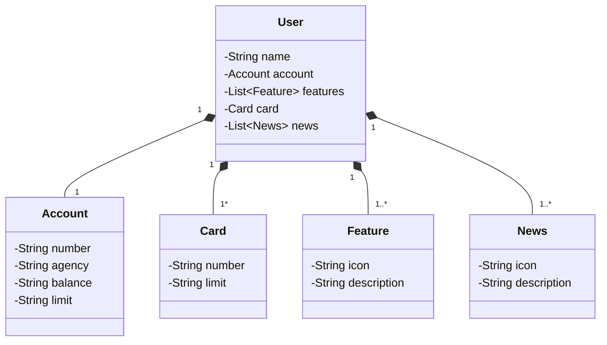

# Santander Dev Week 2023
Esta é uma API construida durante a Santander Dev Week 2023, parceria do Banco Santander com a plataforma de estudos DIO, a API segue a arquitetura REST e foi construida na linguagem JAVA com o framework SpringBoot

## Diagrama de Classes

